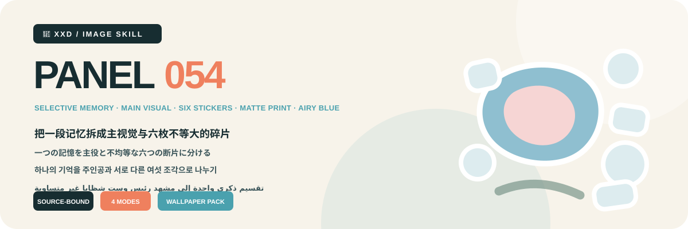

<p align="center"></p>

<div align="center">

# 🦁 XXD Panel 054

### Split one memory into a main image and six unequal fragments

[](./SKILL.md)
[](#)
[](#)

<a href="README.md">简体中文</a> SELECTIVE MEMORY · MAIN VISUAL · SIX STICKERS · MATTE PRINT · AIRY BLUE

Compress the photograph into one narrative main visual and exactly six memory stickers with unequal scale and rank. Matte gouache, cut paper, Risograph, and screen-print texture turn it into a quiet independent-publishing collection page rather than an icon catalogue.

## Why this Skill exists

The style is source-dependent, not a decorative preset. Its operative transformation is:

```text
lock identity, silhouette, posture, and relation → preserve three cues → compress into three to six large shapes → build one main visual → select exactly six source-specific fragments → vary sticker scale, angle, overlap, and hierarchy → unify matte gouache and print texture → retain airy blue whitespace → add minimal copy
```

If an unrelated photograph could replace the source without materially changing the main visual, six fragments, shapes, hierarchy, colour, spacing, and copy, the result does not belong to this Panel.

## The visual contract

- Preserve at least three source-specific cues across silhouette, proportion, posture, action, structure, colour, material, or relation.
- Build one visibly dominant main visual from three to six large shapes, then select exactly six source-supported memory fragments.
- Make the six stickers unequal in scale and rank, arranging them asymmetrically with rotation, overlap, or edge escape; never form a catalogue, six-grid, or equal icon set.
- Give main visual and stickers one matte gouache, cut-paper, Risograph, or screen-print language, led by airy blues, pale neutrals, and tiny muted-blush accents.
- Maintain one focal point through scale contrast, positive-negative shape, overlap, and ample quiet ground.

Complete aesthetic constraints and rejection rules live in the Skill and production prompts. They preserve the original brief without turning its historical 3:4 canvas into a hidden default. [SKILL.md](SKILL.md) · [production prompt](references/xxd-panel-054-prompt.en.md)

## Samples

Samples have not been supplied yet. The reserved location is documented in [assets/examples](assets/examples/README.md). Future samples demonstrate the aesthetic motive only; they never become generation references, fixed subjects, compositions, palettes, copy, or default canvas sizes.

## Four combinable output modes

Choose one or several modes with `1`, `1+3`, `1,2,4`, or `all`. `all` produces seven PNGs per source: three ordinary outputs plus four wallpapers.

| Mode | Default sizing | Result |
| --- | --- | --- |
| `top-bottom` | source-adaptive `W×2H` | full source above and transformed design below, exact 50/50 |
| `left-right` | source-adaptive `2W×H` | full source left and transformed design right, exact 50/50 |
| `design-only` | source-adaptive `W×H` | transformed design only, no visible source |
| `wallpaper-pack` | labelled device sizes | separate phone, iPad, desktop, and children's-watch PNGs |

Wallpapers may be linked or independent. A linked set approves one anchor, then every device references the original plus that same anchor; it never crops or chains derivatives. An independent set gives every device only the original source.

## Copy and locale

Automatic copy, exact custom copy, or text-free output is confirmed before generation. Copy follows the intended audience rather than the command language, and exact user wording remains verbatim.

Project-specific copy rule: derive only one source-bound word, short phrase, or very short title from subject, action, setting, atmosphere, sound, memory, or cultural context; place it small and light in blank space, a sticker gap, or the main-visual edge, and never label every sticker.

## Geometry, raster output, and trust

Ordinary canvases adapt to the source unless overridden. Paired layouts are exact 50/50; all deliverables are raster PNGs. Every invocation creates a fresh task under `~/Desktop/xxd/`, and private route details are never exposed.

The configured bitmap bridge emits sanitised status only. It never exposes providers, endpoints, credentials, headers, prompts, responses, or account details. SVG, HTML, Canvas, diagrams, and programmatic art are not substitutes for final raster artwork.

## Get started

```bash
git clone https://github.com/nevertoday/xxd-panel-054.git
mkdir -p ~/.codex/skills
ln -s "$(pwd)/xxd-panel-054" ~/.codex/skills/xxd-panel-054
```

Claude Code users may link the same folder under `~/.claude/skills/xxd-panel-054`. Restart the agent session after installation.

```text
$xxd-panel-054
Use this photograph, ask me for the modes and copy setting, then generate fresh raster outputs.
```

Full specifications: [Skill workflow](SKILL.md) · [source archive](references/054-source.md) · [English prompt](references/xxd-panel-054-prompt.en.md) · [Chinese prompt](references/xxd-panel-054-prompt.zh-CN.md)

## About XXD

XXD is Xiaoxiaodong's abbreviated brand name. Created and maintained by [@xiaoxiaodong01](https://x.com/xiaoxiaodong01).

## Support and membership

### In-depth consultation · CNY 299/hour

One-to-one in-depth consultation for using Skills. Contact Xiaoxiaodong through WeChat. [WeChat](https://xiaoxiaodong.pages.dev/assets/wechat-qr.png)

### Xiaoxiaodong Skills User Community · CNY 99

A one-time fee joins the Skills user community for workflow sharing and peer discussion; hourly consultation is separate.

### Knowledge Planet + Member Prompt Library · CNY 699/year

One annual payment opens both Knowledge Planet and the member prompt library. Join either side, then contact Xiaoxiaodong on WeChat for the other access.

[Knowledge Planet](https://wx.zsxq.com/group/15554814142882) · [Member Prompt Library](https://vip.xiaoxiaodong.ai/)

<p align="center"><a href="https://xiaoxiaodong.pages.dev/assets/wechat-qr.png"></a></p>

<div align="center"><strong>A memory is not six icons; it is a collection with hierarchy.</strong></div>

---

<div align="center">

## Support this open-source project

Chinese-language support may use Xiaoxiaodong's own WeChat or Alipay reward codes; other editions use Buy Me a Coffee. Support is optional and never changes access to the open-source project.


<p align="center"><a href="https://github.com/nevertoday/zhongguo-traditional-colors/blob/main/docs/images/buy-me-a-coffee-qr.png?raw=true"></a></p>

</div>
</div>
